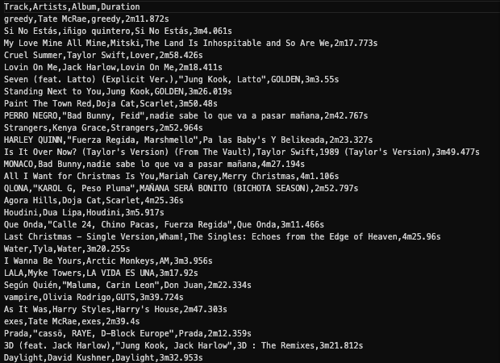
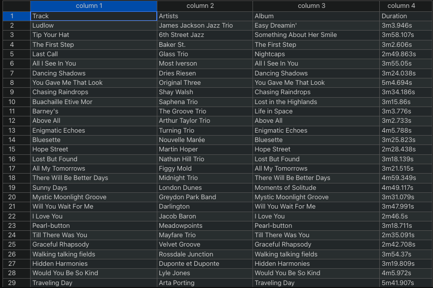

# Spotify Playlist Exporter

`spotify-playlist-exporter` is a Go script that uses `goroutines` and `waitgroups` that converts a Spotify playlist into a .csv file.

## Table of contents:

- [Usage](#usage)
  - [Inputs](#inputs)
  - [Outputs](#outputs)
- [Documentation](#documentation)
- [Bugs/Requests](#bugs_requests)
- [License](#license)

<a name="usage"/>

# Usage

Below are the inputs/outputs to this script:

<a name="inputs"/>

## Inputs:

- `playlistUrls`: A slice of strings. These strings are Spotify playlist urls.

> Example: If you wanted to choose `Jazz in the Background` playlist, this would be the link you would enter in the playlistUrls variable: https://open.spotify.com/playlist/37i9dQZF1DWV7EzJMK2FUI?si=2dc14fb0f2c64435

- `.env` file: on the [Spotify Developer Dashboard](https://developer.spotify.com/dashboard), create a new app. Give it whatever name you'd like, and note the `client id` and `client secret` given to you
  by the dashboard - these will be needed to run the script. Create an `.env` file at the root of this repository. In this file, add these 2 environment variables:

> CLIENT_ID="<YOUR_CLIENT_ID_HERE>"
> CLIENT_SECRET="<YOUR_CLIENT_SECRET_HERE>"

<a name="outputs"/>

## Outputs:

- `./exports/<TIMESTAMP>/<PLAYLIST_NAME>.csv`: .csv files that contain important information about the playlist's tracks such as:
  - Name
  - Artists
  - Album Name
  - Duration

> Example: These are the songs on `Jazz in the Background` playlist in the exported .csv file

This is the same file but in a more user friendly presentation:

<a name="documentation"/>

# Documentation

Documentation of `spotify-playlist-exporter` can be found here: https://github.com/espitiaandres/spotify-playlist-exporter/blob/main/README.md

<a name="bugs_requests"/>

# Bugs/Requests

If you find any bugs or have any suggestions to `spotify-playlist-exporter`, submit them in the issues tab in the Github repo. This can be found here: https://github.com/espitiaandres/spotify-playlist-exporter/issues

<a name="license"/>

# License

Distributed under the terms of the MIT license, `spotify-playlist-exporter` is free and open source software.
